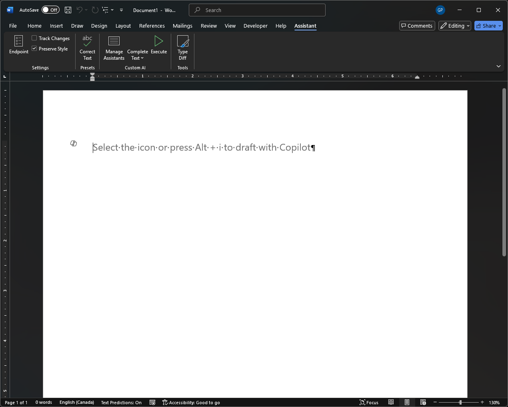
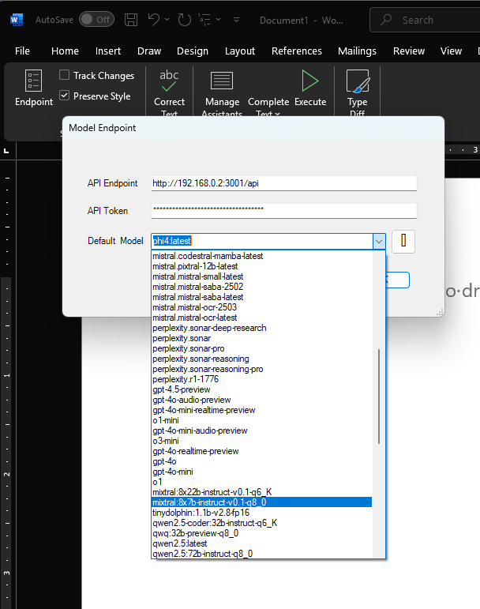
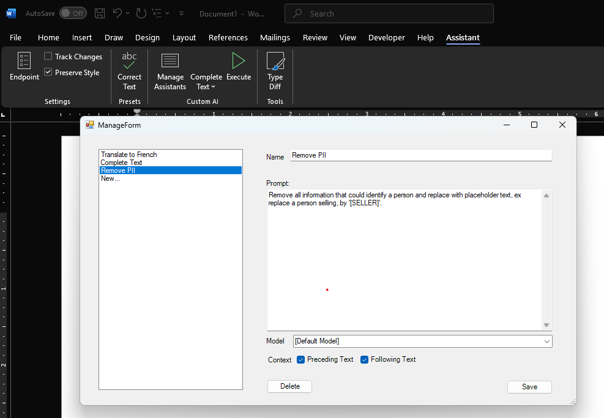
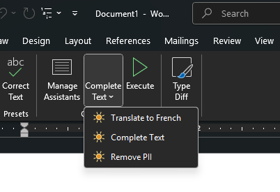
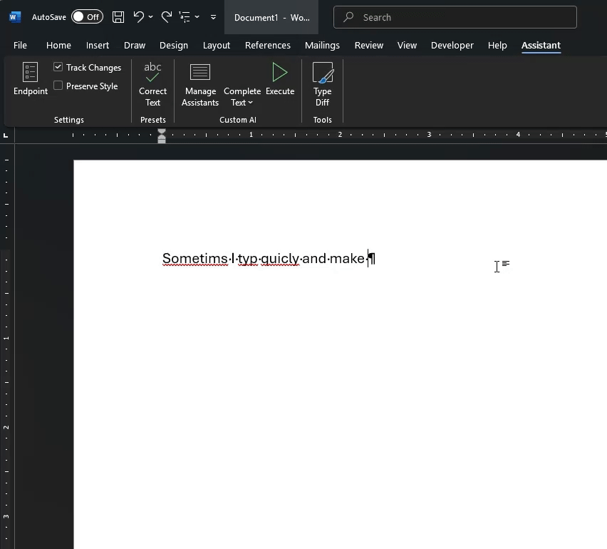

# WordAI

WordAI is a VSTO plugin for Word to integrate LLM tools such as [OpenAI](https://openai.com/). It is designed to also work with offline models using a similar API, including [Ollama](https://ollama.com/) and [Open-WebUI](https://docs.openwebui.com/). Using Open-WebUI as an intermediate, makes it relatively easy to target a wide range of online   models, including [Anthropic Claude](https://www.anthropic.com/claude), [Google Gemini](https://gemini.google.com/), [Mistral AI](https://mistral.ai/), or [Perplexity Sonar](https://sonar.perplexity.ai/) for instance, as well as offline models through Ollama.

When installed, WordAI adds a tab to the Word Ribbon:

## Endpoint Configuration

The "Endpoint" button can be used to configure the LLM endpoint.

- To target OpenAI directly, use `https://api.openai.com/v1/` along with your OpenAI API token.
- To target Ollama, use the OpenAI compatible endpoint (ex. `http://localhost:11434/v1/`)
- To target Open-WebUI, use the OpenAI compatible endpoint (ex. `http://localhost:3000/api/`)

When selecting the endpoint, you should also chose the default model to use from that endpoint.

## Other settings

Two other settings are currently available from the Ribbon:

- Track Changes: when enabled, the result of the LLM will replace selected text using track changes (regardless of whether track changes is currently enabled for the user under the Review tab).
- Preserve Style: when enabled, the LLM will be instructed to preserve Word formatting. This requires the LLM to understand XML. While this works well with sophisticated models such as OpenAI gpt-4o and gpt-4o-mini, very few other models support this well.

## Built-in assistants

Built in assistants are predefined prompts that would generally interest most users. Currently, only a grammar corrector has been implemented.

## Managing Assistants

Additional assistants can be configured to perform custom operations. Assistants are configured by clicking the Manage Assistants button:

The assistant panel allows the creation of new prompts to instruct the LLM on what to do. The instructions are provided to the LLM alone, with the preceding text, with the text following the current location in the document, or with both preceding and following text (thereby, providing partial or full context to the LLM). When translating a document, for instance, it is often preferable to provide the whole document so that terms are translated consistently.

A specific assistant can also be configured to target a specific model instead of the default one.

## Executing Assistants

Assistants are executed by selecting the assistant from the ribbon and pressing "Execute":

## Extra Utilities

Currently, another utility is provided:

- Type Diff is an action which, when clicked, will paste the clipboard over the current Word selection while attempting to only edit changes rather than replace the entire selection. For example, if only a word is being added, the action will transform the paste operation of the entire text into an insertion of the added word only. This is useful when working with tracked changes and copy-pasting text from external tools (ex. another LLM interface). This also enables review of the changes made by the external tool.

# Examples

## Correcting Text with Phi-4 and Tracked Changes

This example uses Phi-4 to correct text (locally), with tracked changes enabled. Notice that the result from Phi-4 is inserted as changes to the text rather than a whole text replacement, allowing for review of the differences.

## Generating Text

Of course, LLMs are also great a generating content (this is Phi-4 again in action). The prompt that was used is `Continue this document by generating a new paragraph based on the guidance.`

## Style-Preserving Translation

Here we compare a similar action performed with Microsoft Copilot and WordAI. Notice how Copilot is currently unable to preserve the original style, while this tool is able to. Unfortunately, at this time, most local LLMs tested were unable to translate while preserving XML formatting, so this example was achieved using OpenAI `gpt-4o-mini`

# Continuous Integration

The GitHub workflow builds the VSTO add-in using a self-signed certificate generated at build time. The certificate is placed in the Windows certificate store and referenced by its thumbprint during the build. It exists solely to satisfy ClickOnce manifest signing requirements and is not intended for production use.

# Contributing

WordAI is definitely BETA software. I use it and "it works on my machine" - Install at your own risks, and reach out if you would like to collaborate for improvements !

